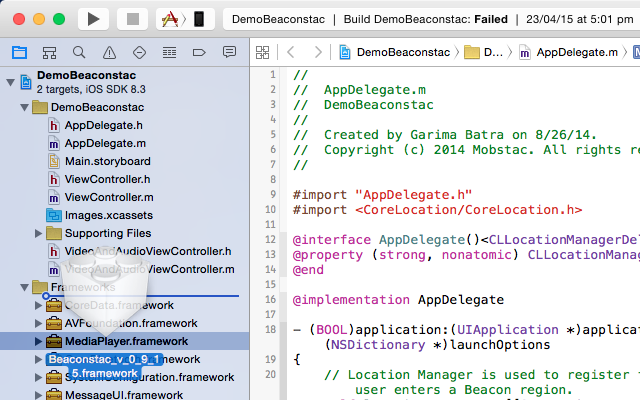
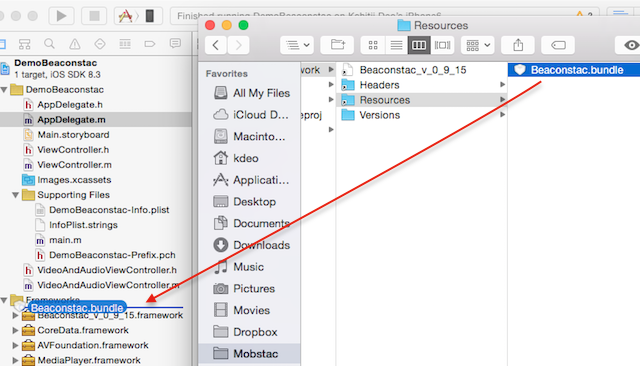
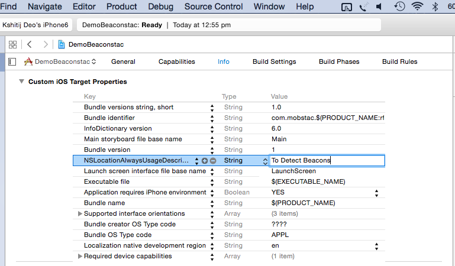

# iOS-SDK

## Introduction

Beaconstac SDK is an easy way to enable proximity marketing and location analytics through an iBeacon-compliant BLE network. 

## Documentation

Please refer to the [API documentation](http://cocoadocs.org/docsets/Beaconstac).

## Demo app

Try out the Beaconstac Demo app on the [iTunes App Store](https://itunes.apple.com/us/app/beaconstac/id956442796?mt=8).

## Installation
##### Using Cocoapods (recommended):
Add the following to your Podfile in your project
		
		pod 'Beaconstac'

Run `pod install` in the project directory

##### Manually:

1. Download or clone this repo on your system.
2. Drag and drop the Beaconstac.framework file into your Xcode project. Make sure that "Copy Items to Destination's Group Folder" is checked.

3. Navigate to Beaconstac.framework/Resources folder in Finder and drop the Beaconstac.bundle into Project navigator area. Make sure that "Copy Items to Destination's Group Folder" checked.

4. In Build Phases under Target, add the following frameworks in “Link Binary With Libraries” section:
	- CoreData.framework
	- SystemConfiguration.framework
	- CoreBluetooth.framework
	- CoreLocation.framework

## Configure your project
	
1. In Info.plist, add a new field, NSLocationAlwaysUsageDescription with relevant value that you want to show to the user. This is mandatory for iOS 8 and above.

2. Import the framework header in your class and make sure the  class conforms to BeaconstacDelegate protocol

		#import <Beaconstac/Beaconstac.h>

3. Initialize Beaconstac using the factory method:
		
		beaconstacInstance = [Beaconstac sharedInstanceWithOrganizationId:<organizationId: Int> developerToken:<developerToken: String>];
        beaconstacInstance.delegate = self;

4. To start ranging beacons:
		
		[beaconstacInstance startRangingBeaconsWithUUIDString:@"F94DBB23-2266-7822-3782-57BEAC0952AC" beaconIdentifier:@"MobstacRegion" filterOptions:nil];
		
5. Implement delegate methods to receive callbacks when beacons are ranged:
		
		- (void)beaconstac:(Beaconstac *)beaconstac rangedBeacons:(NSDictionary *)beaconsDictionary
		{
    		NSLog(@"Beacons around %@",beaconsDictionary);
		}
		
